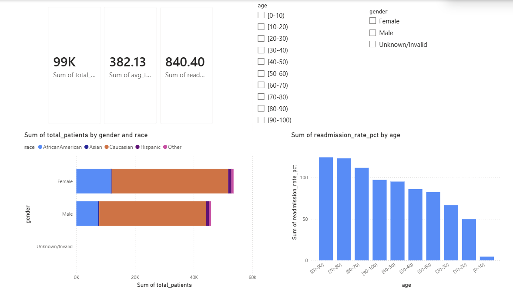

## 🏥 Hospital Readmission Analysis
**Can we identify which diabetic patients are most at risk of 
being readmitted within 30 days?**

Using real hospital data from 130 US hospitals, this project 
analyzes patient demographics, visit history, and clinical 
factors to uncover what drives early readmissions, a key 
quality metric that directly affects hospital funding and 
patient outcomes.

---

## 📊 Dataset
- **Source:** UCI Machine Learning Repository — Diabetes 
130-US Hospitals (1999–2008)
- **Size:** 101,766 patient records across 130 US hospitals
- **Tools:** Python (Pandas, Seaborn, Matplotlib) | Power BI

---

## 🔍 Key Findings

**Overall Readmission Rate: 11.2%**

**Age:**
- Surprisingly, the 20–30 age group had the *highest* 
readmission rate at 14.2% - higher than any elderly group
- The 80–90 group followed at 12.1%, suggesting both young 
and very elderly diabetic patients need closer post-discharge 
monitoring
- The 50–60 group had the lowest adult readmission rate at 9.7%

**Prior Hospital Visits — the strongest predictor:**
- Patients with 3 or more prior inpatient visits had a 
readmission rate of **25.7%** -more than 2.5x the rate of 
patients with fewer visits (10.1%)
- This is the single most actionable insight: prior visit 
history is a strong flag for intervention

**Hospital Stay Length:**
- Readmitted patients averaged **4.8 days** per stay vs 
4.3 days for non-readmitted patients
- A longer stay did not prevent readmission, suggesting 
discharge planning quality matters more than stay duration

**Gender:** Nearly identical rates- Female 11.2% vs Male 
11.1% — gender is not a meaningful predictor here

**Race:** Minimal variation across groups (9.6%–11.3%), 
suggesting readmission risk in this dataset is not strongly 
race-dependent

---

## 💡 Business Recommendation
If a hospital wanted to reduce 30-day readmissions, the 
data points to two high-priority patient groups to flag 
at discharge:
1. Patients aged 20–30 with a diabetes diagnosis
2. Any patient with 3 or more prior inpatient visits

Targeted follow-up programs (call check-ins, scheduled 
outpatient visits) for these groups could meaningfully 
move the readmission rate.

---

## 📁 Files
- `analysis.ipynb` — Full Python notebook (data cleaning, 
EDA, visualizations)
- `readmissions_summary.csv` — Cleaned and aggregated 
export used for Power BI dashboard

---

## 📸 Dashboard Preview

